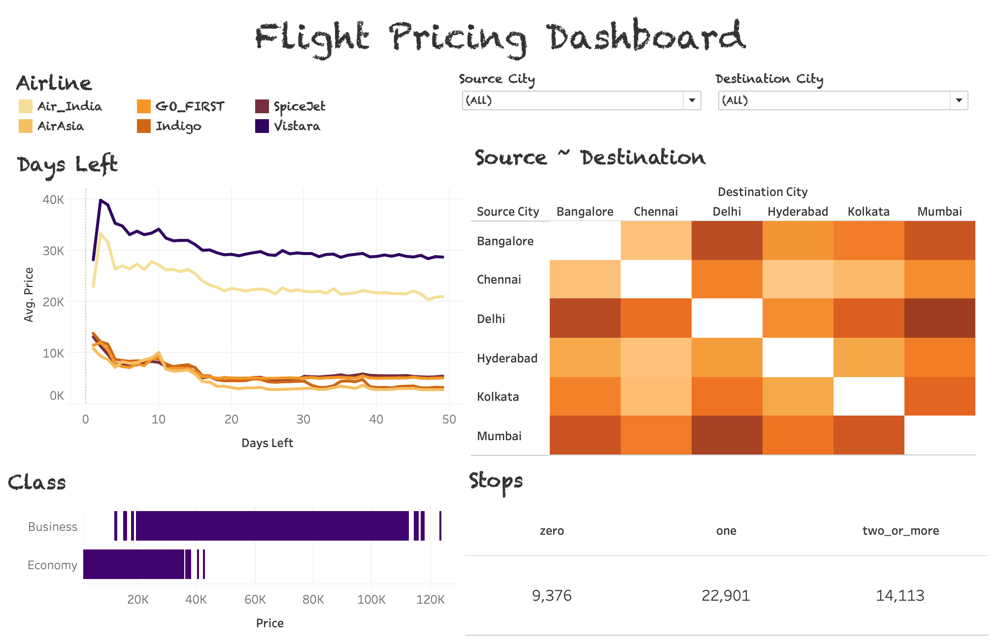

# Dynamic Flight Model Simulation

## Overview
This project implements a Dynamic Flight Pricing Model using machine learning techniques. It predicts flight prices based on factors such as airline, source, destination and departure time. The solution includes data processing, model building, visualisation, and deployment.

## Tech Stack
- Python 3.x 
- SQLite 3.x (Database)
- Streamlit (Web App Deployment)
- Tableau Public (Data Visualisation)
- Libraries: pandas, seaborn, matplotlib, pathlib, scikit-learn

## Structure
```
src/
├── analysis.py
├── app.py
├── load_data.py
├── ddl_scripts.sql
notebooks/
├── linear_regression.pkl
data/
├── flight_price.csv
database/
├── flight_pricing.db
tableau/
├── flight_pricing_dashboard.twb_
README.md
requirements.txt
```

## Steps Implemented
1. Data Collection

- Download dataset from https://www.kaggle.com/datasets/shubhambathwal/flight-price-prediction.
- Save as data/flight_price.csv.

2. Database Setup (SQLite)

- Create flight_pricing.db and table for flights.

3. Data Loading & Cleaning

- Load CSV into SQLite.

4. Exploratory Data Analysis (EDA)

- Visualise price trends using Matplotlib & Seaborn.

5. Model Building

- Train a Linear Regression model.
- Evaluate using RMSE and R².

6. Deployment with Streamlit

- Build an interactive web app for predictions.

7. Tableau Dashboard

- Visualise price trends and route analysis.

## How to Use


1. Clone the repository:

git clone https://github.com/ahot228/data-science-portfolio

cd flight_pricing_model


2. Install dependencies:

pip install -r requirements.txt

3. Run Streamlit app:

streamlit run src/app.py

## Tableau

Visualisations:
- Line Chart: Price vs Days to Departure
- Heatmap: Source-Destination routes
- Gant Bar Chart: Price per class
- Table: Stops vs Price

https://public.tableau.com/app/profile/anish.hota/viz/flight_pricing_dashboard/FlightPricingModel


