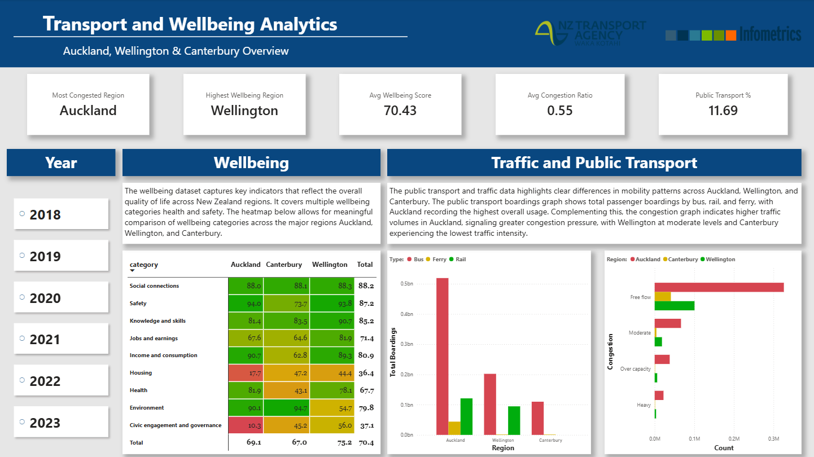

# Transport and Wellbeing Analytics Platform

## Overview
This project is an end-to-end data analytics platform that analyses public transport usage, traffic congestion, and wellbeing scores across major New Zealand regions: Auckland, Wellington, and Canterbury. The project demonstrates industry-ready skills in data cleaning, SQL analysis, and dashboard development.

The platform integrates public transport boardings, traffic count data, and wellbeing metrics to explore the relationship between mobility, congestion, and quality of life.

## Tech Stack
- Microsoft Excel and Power Query (Data Cleaning)
- PostgreSQL 3.x (Database and data manipulation)
- Power BI and DAX (Data Visualisation)

## Data Sources
- Infometrics – Wellbeing 
  Regional wellbeing indices across multiple domains (health, environment, civic engagement, etc.)

- NZ Transport Agency (NZTA) Open Data
  Traffic count and monitoring site data used to estimate congestion levels
  Public transport boardings by mode and region, including SuperGold boardings

## Steps Implemented
1. Raw CSV / Excel Files gathered

2. Power Query / Excel (Cleaning & Transformation)

3. PostgreSQL Database

4. Power BI Dashboard (DAX Measures)

## Data Model

- public_transport_final  
    Region, transport mode, measure type (Boardings, SuperGold), values

- traffic_final  
    Traffic counts, lane data, congestion ratios, congestion categories

- wellbeing_final
    Wellbeing scores by category, region, and year

These tables were connected throug hthe year and region categories.

## Measures with SQL and DAX
- congestion_ratio and congestion_level (derived from traffic count and lane number)
- Most Congested Region (through congestion_ratio and group by region)
- Highest Wellbeing Region (through wellbeing_score and group by region)
- Public Transport % (from boardings and traffic_count)

All calculations are implemented using **DAX** and validated with SQL queries.

## Repository Structure
```
data/
├── traffic.zip (zipped due to file being too big)
    ├── traffic.csv
    ├── traffic_final.csv 
├── wellbeing.csv
├── wellbeing_final.csv
├── public-transport.csv
├── public_transport_final.csv
database/
├── PostgreSQL_snippet.txt
visuals/
├── transport-dashboard.pbix
├── transport-dashboard.png
README.md
```

## Dashboard
The Power BI report includes:

1. Regional KPIs and summary insights with DAX commands

2. Transport Usage – Public transport boardings by mode and region 

3. Congestion – Amount of congestion levels by region

4. Wellbeing Analysis – Heatmap of wellbeing categories across regions 
 


## Key Takeaways
- Auckland experiences the highest traffic volumes but also the highest PT demand
- Wellington demonstrates strong wellbeing scores relative to the other regions
- Public transport anf traffic seems to have a little effect on wellbeing
